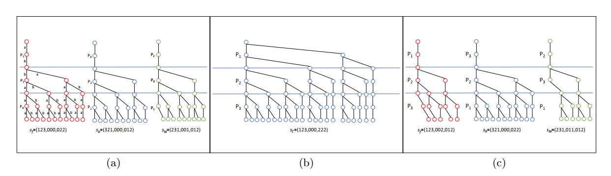
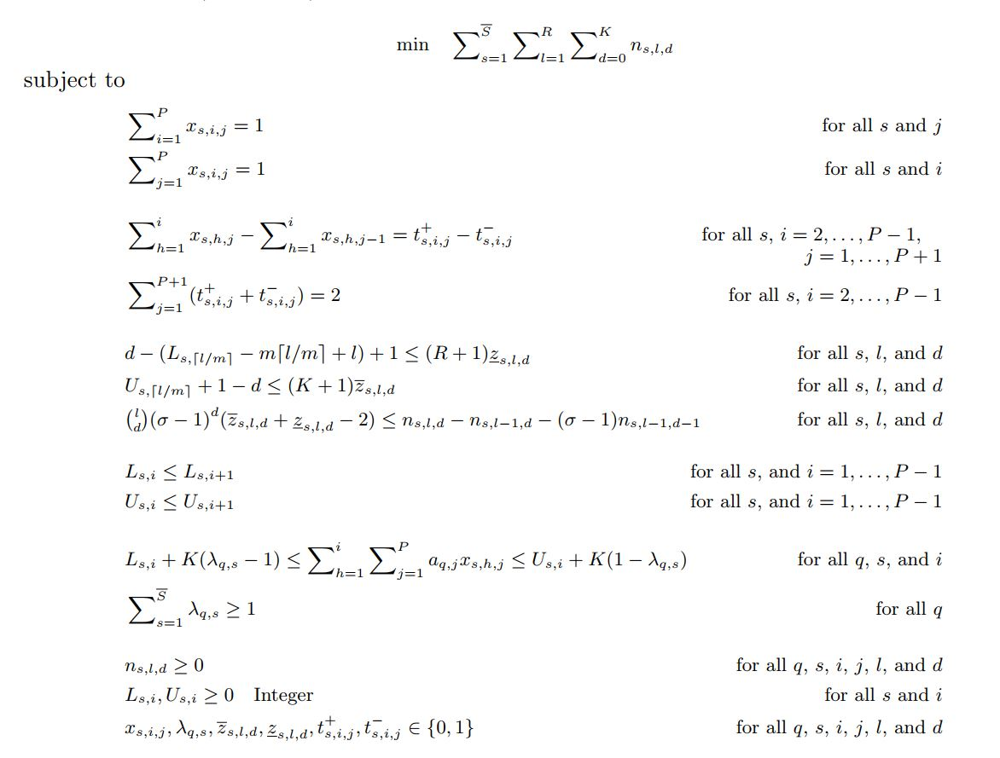

# Optimum Search Schemes for Approximate String Matching Using Bidirectional FM-Index

Welcome to the repository for the paper *"Optimum Search Schemes for Approximate String Matching Using Bidirectional FM-Index"*. This repository contains the implementation and resources related to our research.

## Table of Contents

- [Introduction](#introduction)
- [Features](#features)
- [Computer Science Concepts](#computer-science-concepts)
- [Programming Details](#programming-details)
- [Applied Mathematics](#applied-mathematics)
- [Results](#results)

## Introduction

Finding approximate occurrences of a pattern in a text using a full-text index is a central problem in bioinformatics. This repository provides the source code and data for our novel approach to solving this problem using bidirectional FM-index and mixed integer programming (MIP).

## Features

- **Optimal Search Schemes**: Uses MIP to find optimal search schemes for Hamming distance.
- **Bidirectional FM-Index**: Efficiently handles searches from any position within the pattern.
- **Performance**: Significant speed-up over standard backtracking methods.

## More Information

For detailed instructions and usage examples, please refer to the README files inside the following folders:
- `BenchmarkCode-ITV`
- `BenchmarkCode`
- `MIPCode`

## Computer Science Concepts

### Approximate String Matching

The approximate string matching (ASM) problem involves finding substrings in a text that match a pattern approximately, within a specified number of errors (e.g., mismatches, insertions, deletions).

### Bidirectional FM-Index

The bidirectional FM-index allows for flexible searching from any position within the pattern, enabling efficient Approximate String Matching (ASM). It leverages the Burrows-Wheeler Transform (BWT), a key component in many compression algorithms, to support fast substring queries.

The Burrows-Wheeler Transform rearranges the characters of a string into runs of similar characters, which allows for more efficient compression. In the context of string matching, it enables backward searching in the compressed data, facilitating bidirectional searches that start from any position within the pattern and extend in both directions.

The FM-index is built upon the BWT and includes additional auxiliary data structures like the suffix array and rank/select dictionaries. These structures help in performing quick and efficient substring searches:

- **Suffix Array**: An array of integers giving the starting positions of suffixes of a string in lexicographical order. This helps in efficiently finding the position of any substring within the original text.
- **Rank/Select Dictionaries**: These are used to support fast rank and select operations on the BWT. The rank operation counts the number of occurrences of a character up to a certain position, while the select operation finds the position of the nth occurrence of a character.

By combining these elements, the FM-index enables quick navigation through the text in both forward and backward directions. This is particularly useful for approximate string matching, where searches may start from any point within the pattern and require flexibility in handling errors.

### Tries

A search scheme can be visualized by representing each of its searches as a trie that captures all substrings enumerated by the search. Each edge at a level of the trie corresponds to a character of the alphabet at that level of search. A vertical edge represents a match, and a diagonal edge represents a mismatch. The number of edges in the tries provides a measure of the efficiency of the search scheme.

### Dynamic Programming for Edit Distance Calculation

For edit distance calculations, the Smith-Waterman algorithm is employed to handle mismatches, insertions, and deletions efficiently. The dynamic programming approach constructs a matrix where the entry at row i and column j represents the edit distance between the first i characters of the pattern and the first j characters of the text. This matrix can be filled in polynomial time, ensuring that all possible edit distances are considered.

## Programming Details

### Mixed Integer Programming (MIP)

We formulated the search optimization as an MIP problem to find the optimal search schemes. This involves defining variables and constraints to minimize the search steps while covering all possible mismatch patterns.

The MIP formulation is designed to solve the optimal search scheme problem, which is a well-known combinatorial optimization problem. This problem involves finding the search scheme that minimizes the number of steps in ASM-B while ensuring all possible mismatch patterns are covered.

## Applied Mathematics

### Mathematical Formulation

Our MIP approach is defined by the following formulation:

### For a generalized version of the problem, searches, and formulation visit my Ph.D. Thesis at Texas A&M University:

    <a href="https://oaktrust.library.tamu.edu/bitstream/handle/1969.1/191893/TORKAMANDI-DISSERTATION-2020.pdf?sequence=1&isAllowed=y" style="display: inline-block; padding: 15px 30px; font-size: 20px; font-weight: bold; color: white; background-color: #007bff; border-radius: 5px; text-decoration: none; box-shadow: 0 4px 6px rgba(0, 0, 0, 0.1); transition: box-shadow 0.3s, transform 0.3s;">
        
        Ph.D. Thesis
    </a>

## Results

### Performance Gains

- Our experiments demonstrate significant improvements over standard backtracking methods, with speed-ups up to 35 times for certain cases. 
- Rapid convergence of feasible solutions to the optimal solution.
